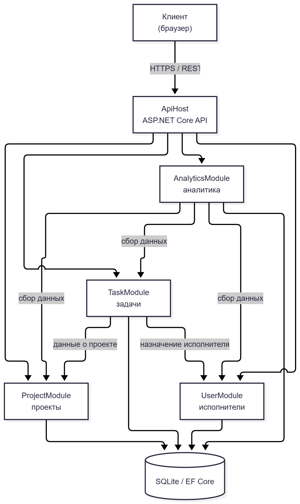

# Курсовое проектирование. Этап 1

## Разработка перечня артефактов и протоколов проекта

Тема курсового проекта: «Разработка системы управления задачами проекта»

МДК: 02.02 «Инструментальные средства разработки программного обеспечения»
Стек: C# / .NET 9, Git
Тип приложения: веб-приложение с серверной частью на ASP.NET Core

# 1. Исходное состояние проекта

Перед началом выполнения этапа был создан Git-репозиторий курсового проекта.

Исходное состояние было проверено командой:

```bash
git status
```

Текущая ветка:

```text
main
```

Работа велась в ветке `main`. Репозиторий доступен по адресу:
https://github.com/Vladik-vali/task-management-system

# 2. Назначение и границы проекта

## 2.1. Назначение системы

Приложение для постановки и контроля выполнения задач. Реализует проекты, задачи, исполнителей, приоритеты, сроки и статусы выполнения. Предусматривает поиск, фильтрацию и получение информации о состоянии проекта.

Пользователь системы должен иметь возможность:

- создавать проекты и задачи;
- назначать исполнителей на задачи;
- устанавливать приоритеты и сроки выполнения;
- изменять статусы задач;
- искать и фильтровать задачи;
- получать сводную информацию о состоянии проекта.

## 2.2. Основные объекты предметной области

- проект;
- задача;
- исполнитель;
- приоритет;
- статус выполнения;
- срок (дедлайн).

## 2.3. Границы проекта

### В систему входит

- Ведение списка проектов.
- Создание, редактирование и удаление задач.
- Назначение исполнителей.
- Установка приоритетов и сроков.
- Изменение статусов задач.
- Поиск и фильтрация задач.
- Просмотр состояния проекта.

### В систему не входит

- Интеграция с внешними системами (Jira, Trello).
- Уведомления (Email, Push).
- Мобильное приложение.
- Диаграммы Ганта.
- Управление правами на уровне отдельных задач.

# 3. Реестр проектных артефактов

| № | Артефакт | Назначение | Расположение |
|---:|---|---|---|
| 1 | Описание назначения и границ | Функции и ограничения системы | `docs/project-scope.md` |
| 2 | Перечень модулей | Состав и ответственность модулей | `docs/modules.md` |
| 3 | Архитектурная схема | Структура и связи модулей | `docs/architecture.md`, `img/architecture.png` |
| 4 | Перечень зависимостей | Внутренние и внешние зависимости | `docs/dependencies.md` |
| 5 | Контракты взаимодействия | Правила обмена между модулями | `docs/contracts.md`, `docs/protocol-task-assignment.md`, `docs/protocol-project-analytics.md` |
| 6 | DTO | Структуры передаваемых данных | `Этап_1_task-management-system.md`, раздел 9 |
| 7 | Инструкция сборки и запуска | Запуск проекта другим разработчиком | `README.md` |
| 8 | Тестовая стратегия | Порядок проверки системы | `docs/testing.md` |
| 9 | Правила работы с Git | Ветвление и коммиты | `docs/version-control.md` |
| 10 | Журнал технических решений | Значимые архитектурные решения | `docs/decisions/` |

# 4. Перечень модулей системы

В проекте выделено четыре основных функциональных модуля.

| Модуль | Ответственность |
|---|---|
| `ProjectModule` | Хранение информации о проектах и управление ими |
| `TaskModule` | Создание и управление задачами, статусами и приоритетами |
| `UserModule` | Хранение информации об исполнителях |
| `AnalyticsModule` | Формирование сводной информации о состоянии проектов |

Дополнительно используется `ApiHost`, который принимает запросы от пользовательского интерфейса и передаёт их соответствующим модулям.

## 4.1. ProjectModule

Отвечает за ведение проектов. Основные функции:

- создание проекта;
- получение списка проектов;
- получение информации о проекте;
- изменение параметров проекта;
- архивирование проекта;
- удаление проекта.

Пример состояний проекта:

```text
Active
Archived
Completed
```

## 4.2. TaskModule

Отвечает за работу с задачами. Основные функции:

- создание задачи;
- редактирование задачи;
- назначение исполнителя;
- установка приоритета;
- установка срока выполнения;
- изменение статуса задачи;
- удаление задачи.

Модуль взаимодействует с:

```text
ProjectModule
UserModule
AnalyticsModule
```

Пример статусов:

```text
New
InProgress
OnReview
Done
Cancelled
```

Пример приоритетов:

```text
Low
Medium
High
Critical
```

## 4.3. UserModule

Отвечает за работу с исполнителями. Основные функции:

- регистрация исполнителя;
- получение данных исполнителя;
- изменение контактных данных;
- получение списка задач исполнителя;
- проверка доступности исполнителя для назначения.

Пример ролей:

```text
Executor
Manager
Administrator
```

## 4.4. AnalyticsModule

Отвечает за формирование сводной информации. Основные функции:

- подсчёт количества задач по статусам;
- подсчёт просроченных задач;
- подсчёт завершённых задач за период;
- формирование отчёта по проекту;
- формирование отчёта по исполнителю.

Модуль взаимодействует с:

```text
TaskModule
ProjectModule
UserModule
```

# 5. Архитектурная схема

Для проекта выбрана модульная архитектура. Диаграмма построена по коду Mermaid на сайте https://mermaid.live и хранится в `img/architecture.png`.



## Описание схемы

| Компонент | Назначение |
|---|---|
| `ApiHost` | Точка входа: приём и маршрутизация HTTP-запросов |
| `TaskModule` | Создание и управление задачами |
| `ProjectModule` | Управление проектами |
| `UserModule` | Данные исполнителей |
| `AnalyticsModule` | Сводная информация о состоянии проектов |
| `SQLite / EF Core` | Хранение данных в учебной версии |

Центральным модулем бизнес-процесса является `TaskModule`. При создании задачи он обращается к `UserModule` для проверки исполнителя и к `ProjectModule` для привязки к проекту. Модуль `AnalyticsModule` собирает данные из всех модулей.

Бизнес-модули не обращаются к внутренним классам друг друга напрямую: взаимодействие выполняется через публичные интерфейсы и DTO из слоя Contracts.

# 6. Структура решения

## 6.1. Текущий состав репозитория (этап 1)

```text
task-management-system/
 │
 ├── docs/
 │   ├── project-scope.md
 │   ├── modules.md
 │   ├── architecture.md
 │   ├── dependencies.md
 │   ├── contracts.md
 │   ├── protocol-task-assignment.md
 │   ├── protocol-project-analytics.md
 │   ├── testing.md
 │   ├── version-control.md
 │   └── decisions/
 │       ├── ADR-001-modular-architecture.md
 │       └── ADR-002-module-contracts.md
 │
 ├── img/
 │   └── architecture.png
 │
 ├── Этап_1_task-management-system.md
 └── README.md
```

## 6.2. Планируемая структура на этапе реализации

```text
TaskManagement/
 │
 ├── src/
 │   ├── TaskManagement.Api/
 │   ├── TaskManagement.Projects/
 │   ├── TaskManagement.Tasks/
 │   ├── TaskManagement.Users/
 │   ├── TaskManagement.Analytics/
 │   └── TaskManagement.Contracts/
 │
 ├── tests/
 │   ├── TaskManagement.UnitTests/
 │   └── TaskManagement.IntegrationTests/
 │
 ├── docs/
 ├── img/
 ├── .gitignore
 ├── .editorconfig
 ├── README.md
 ├── Этап_1_task-management-system.md
 └── TaskManagement.sln
```

# 7. Внутренние зависимости

```text
Api → Tasks → Contracts
Api → Projects → Contracts
Api → Users → Contracts
Api → Analytics → Contracts
```

Бизнес-модули не должны напрямую обращаться к внутренним классам друг друга. Взаимодействие выполняется через публичные контракты, например:

```text
TaskModule
      ↓
IUserService
      ↓
UserModule
```

# 8. Внешние зависимости

| Зависимость | Назначение |
|---|---|
| .NET 9 | Платформа выполнения |
| ASP.NET Core | Разработка серверного API |
| Entity Framework Core | Доступ к данным |
| SQLite | Хранение данных в учебной версии |
| xUnit | Модульное тестирование |
| Git | Контроль версий |

# 9. Основные DTO проекта

## 9.1. ProjectDto

```csharp
public record ProjectDto(
    Guid Id,
    string Name,
    string Description
);
```

## 9.2. CreateTaskRequest

```csharp
public record CreateTaskRequest(
    Guid ProjectId,
    string Title,
    string Description,
    Guid? AssigneeId,
    string Priority,
    DateOnly DueDate
);
```

## 9.3. TaskDto

```csharp
public record TaskDto(
    Guid Id,
    Guid ProjectId,
    string Title,
    string Status,
    string Priority,
    Guid? AssigneeId,
    DateOnly DueDate
);
```

## 9.4. AssignTaskRequest

```csharp
public record AssignTaskRequest(
    Guid TaskId,
    Guid UserId
);
```

## 9.5. AssignUserResult

```csharp
public record AssignUserResult(
    bool Success,
    string? ErrorCode
);
```

## 9.6. ProjectAnalyticsDto

```csharp
public record ProjectAnalyticsDto(
    Guid ProjectId,
    int TotalTasks,
    int CompletedTasks,
    int InProgressTasks,
    int OverdueTasks
);
```

## 9.7. UpdateTaskStatusRequest

```csharp
public record UpdateTaskStatusRequest(
    Guid TaskId,
    string NewStatus
);
```

# 10. Описание API

| Метод | Адрес | Назначение |
|---|---|---|
| `GET` | `/api/projects` | Список проектов |
| `POST` | `/api/projects` | Создание проекта |
| `GET` | `/api/projects/{id}/tasks` | Задачи проекта |
| `POST` | `/api/tasks` | Создание задачи |
| `GET` | `/api/tasks/{id}` | Получение задачи |
| `PUT` | `/api/tasks/{id}/status` | Обновление статуса |
| `PUT` | `/api/tasks/{id}/assignee` | Назначение исполнителя |
| `GET` | `/api/analytics/projects/{id}` | Аналитика по проекту |

# 11. Протокол взаимодействия № 1

## Назначение исполнителя на задачу

### 11.1. Инициатор и получатель

Инициатор: `TaskModule`
Получатель: `UserModule`

### 11.2. Назначение

Протокол используется при назначении исполнителя на задачу. Необходимо убедиться, что пользователь существует и может быть назначен.

### 11.3. Механизм вызова

Асинхронный вызов через интерфейс `IUserService`. Зависимость передаётся через Dependency Injection.

### 11.4. Точка входа

```csharp
Task<AssignUserResult> AssignUserAsync(
    AssignTaskRequest request,
    CancellationToken cancellationToken);
```

### 11.5. Формат запроса

```json
{
  "taskId": "8939af05-2a59-4758-a263-75df01c6d3f0",
  "userId": "4f7fb20d-b92c-4082-a031-7eb643216a18"
}
```

### 11.6. Успешный ответ

```json
{
  "success": true,
  "errorCode": null
}
```

### 11.7. Ошибки

| Код | Описание |
|---|---|
| `USER_NOT_FOUND` | Пользователь не существует |
| `USER_NOT_AVAILABLE` | Пользователь не может быть назначен |

### 11.8. Таймаут

3 секунды. Отмена — через `CancellationToken`.

### 11.9. Повторная отправка

Автоматический повтор не выполняется.

### 11.10. Аутентификация

Не требуется — вызов внутри одного приложения.

### 11.11. Версия контракта

`UserAssignmentContract v1`

### 11.12. Пример обмена

```text
TaskModule
      │
      │ AssignUserAsync(...)
      ▼
UserModule
      │
      │ Проверка пользователя
      ▼
AssignUserResult
      │
      ▼
TaskModule
```

# 12. Протокол взаимодействия № 2

## Получение аналитики по проекту

### 12.1. Инициатор и получатель

Инициатор: `ApiHost`
Получатель: `AnalyticsModule`

### 12.2. Назначение

Получение сводной информации о состоянии проекта: количество задач по статусам, число просроченных задач.

### 12.3. Механизм вызова

Асинхронный вызов через интерфейс `IAnalyticsService`.

### 12.4. Точка входа

```csharp
Task<ProjectAnalyticsDto> GetProjectAnalyticsAsync(
    Guid projectId,
    CancellationToken cancellationToken);
```

### 12.5. Формат запроса

Параметр пути: `projectId`.

### 12.6. Успешный ответ

```json
{
  "projectId": "8939af05-2a59-4758-a263-75df01c6d3f0",
  "totalTasks": 10,
  "completedTasks": 5,
  "inProgressTasks": 3,
  "overdueTasks": 2
}
```

### 12.7. Ошибки

| Код | Описание |
|---|---|
| `PROJECT_NOT_FOUND` | Проект не существует |

### 12.8. Таймаут

3 секунды.

### 12.9. Повторная отправка

Допускается — операция идемпотентна.

### 12.10. Аутентификация

Не требуется.

### 12.11. Версия контракта

`AnalyticsContract v1`

### 12.12. Пример обмена

```text
ApiHost
      │
      │ GetProjectAnalyticsAsync(projectId)
      ▼
AnalyticsModule
      │
      │ Сбор данных
      ▼
ProjectAnalyticsDto
      │
      ▼
ApiHost
```

# 13. Общий сценарий работы с задачей

```text
Пользователь
   │
   │ Создаёт задачу
   ▼
ApiHost
   │
   ▼
TaskModule
   │
   ├──────────────► UserModule
   │                 Проверка исполнителя
   │
   ├──────────────► ProjectModule
   │                 Проверка проекта
   │
   │ Создание Task
   │
   └──────────────► AnalyticsModule
                     Обновление сводной информации
```

# 14. Инструкция сборки и запуска

## Требования

- .NET SDK 9
- Git

Проверка версии .NET:

```bash
dotnet --version
```

## Получение проекта

```bash
git clone https://github.com/Vladik-vali/task-management-system.git
cd task-management-system
```

## Восстановление зависимостей

```bash
dotnet restore
```

## Сборка

```bash
dotnet build
```

## Выполнение тестов

```bash
dotnet test
```

## Запуск

```bash
dotnet run --project src/TaskManagement.Api
```

# 15. Тестовая стратегия

## 15.1. Модульные тесты

- Создание задачи с корректными данными — успешно.
- Назначение существующего исполнителя — успешно.
- Назначение несуществующего исполнителя — `USER_NOT_FOUND`.
- Смена статуса задачи — успешно.
- Расчёт просроченных задач — корректное количество.

## 15.2. Интеграционные тесты

Сценарий 1. Успешное создание задачи и назначение исполнителя:

```text
TaskModule → UserModule → TaskModule → ProjectModule
```

Ожидается: задача создана, исполнитель назначен.

Сценарий 2. Попытка назначить несуществующего пользователя:

Ожидается: задача не назначена, ошибка `USER_NOT_FOUND`.

## 15.3. Проверка сборки

```bash
dotnet build
dotnet test
```

# 16. Правила ведения репозитория

Основные ветки:

```text
main
develop
feature/*
fix/*
docs/*
```

# 17. Правила коммитов

Используются следующие префиксы:

- `feat:` — новая функциональность
- `fix:` — исправление
- `docs:` — документация
- `test:` — тесты
- `refactor:` — изменение структуры
- `chore:` — техническое изменение

Примеры:

```text
docs: add project-scope.md
docs: add architecture.md
docs: add ADR-001 modular architecture
```

# 18. Журнал технических решений

## ADR-001. Использование модульной архитектуры

Статус: Принято.
Решение: разделить приложение на модули `Projects`, `Tasks`, `Users`, `Analytics`.

## ADR-002. Взаимодействие через контракты

Статус: Принято.
Решение: взаимодействие модулей через публичные интерфейсы и DTO.

# 19. Проверка выполнения этапа

| Требование | Результат |
|---|---|
| Описано назначение проекта | Выполнено |
| Определены границы проекта | Выполнено |
| Выделены модули | Выполнено |
| Описана ответственность модулей | Выполнено |
| Подготовлена архитектурная схема | Выполнено |
| Определены внутренние зависимости | Выполнено |
| Определены внешние зависимости | Выполнено |
| Описан API | Выполнено |
| Созданы модели DTO | Выполнено |
| Описаны минимум два протокола | Выполнено |
| Подготовлена инструкция запуска | Выполнено |
| Подготовлена тестовая стратегия | Выполнено |
| Определены правила Git | Выполнено |
| Создан журнал технических решений | Выполнено |

# 20. Изменения в репозитории

Созданы:

```text
docs/project-scope.md
docs/modules.md
docs/architecture.md
docs/dependencies.md
docs/contracts.md
docs/protocol-task-assignment.md
docs/protocol-project-analytics.md
docs/testing.md
docs/version-control.md
docs/decisions/ADR-001-modular-architecture.md
docs/decisions/ADR-002-module-contracts.md
img/architecture.png
README.md
Этап_1_task-management-system.md
```

# 21. Пример истории Git

```text
docs: add project-scope.md
docs: add modules.md
docs: add architecture.md
docs: добавлена архитектурная схема
docs: add dependencies
docs: add protocol-task-assignment.md
docs: add ADR-001 modular architecture
...
```

Проверка:

```bash
git log --oneline
git status
```

# 22. Что было получено в результате этапа

- определено назначение системы управления задачами;
- установлены границы проекта;
- выделены четыре функциональных модуля;
- сформирована архитектурная схема;
- описаны внутренние и внешние зависимости;
- определены основные DTO;
- определены точки входа API;
- разработаны два протокола взаимодействия;
- определена тестовая стратегия;
- определены правила ведения Git-репозитория;
- зафиксированы основные архитектурные решения.

# 23. Оставшиеся риски

Риск 1. Одновременное назначение одной задачи нескольким исполнителям.
Риск 2. Ошибка после создания задачи — необходимо предусмотреть откат.
Риск 3. Изменение контрактов — контроль совместимости DTO.
Риск 4. Некорректные сроки — валидация дат.

# 24. Вывод

В рамках первого этапа курсового проектирования была сформирована проектная основа системы управления задачами. Определены назначение и границы системы, состав функциональных модулей, их ответственность и зависимости. Разработана архитектурная схема, определены основные DTO и точки входа API. Подробно описаны два протокола взаимодействия. Созданная документация позволяет перейти к следующим этапам разработки.