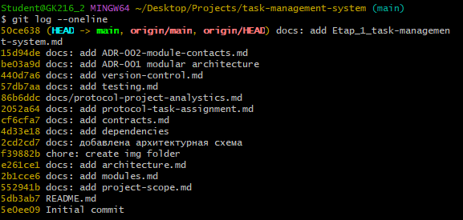
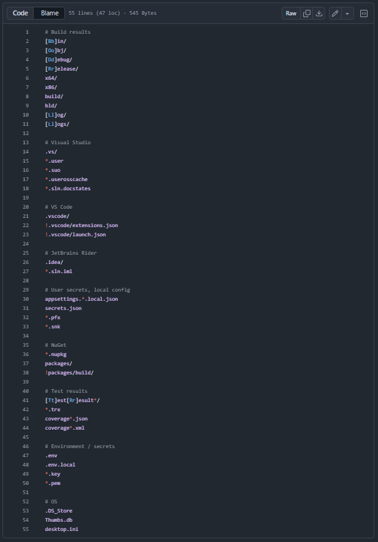
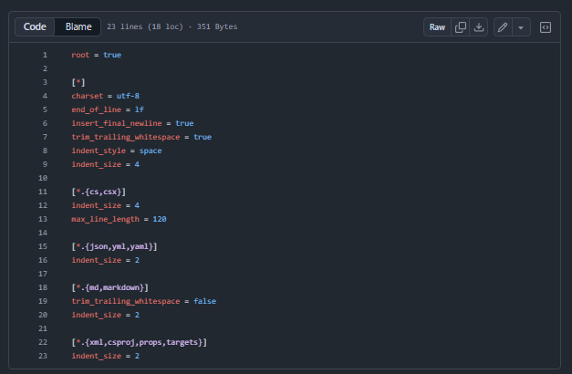
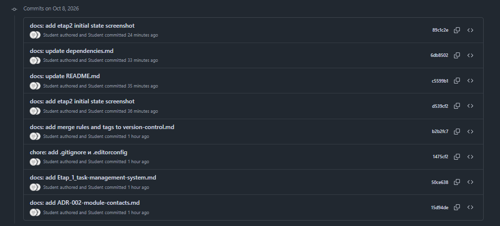
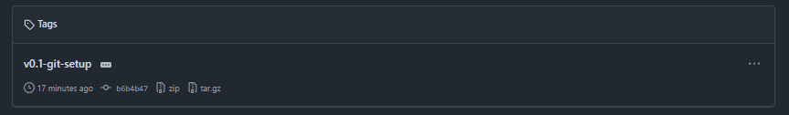
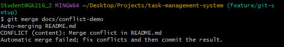
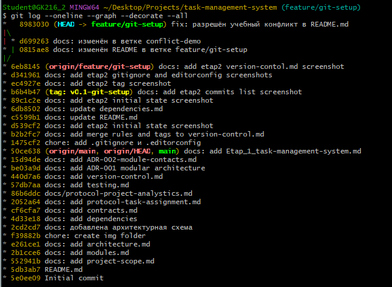
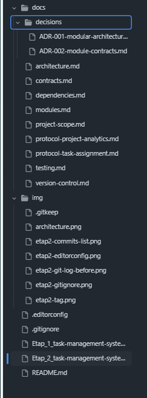

# Курсовое проектирование. Этап 2

## Настройка работы системы контроля версий: типы импортируемых файлов, пути, фильтры и параметры импорта в репозиторий

Тема курсового проекта: «Разработка системы управления задачами проекта»

МДК: 02.02 «Инструментальные средства разработки программного обеспечения»

Стек: C# / .NET 9, Git

Форма: этап курсового проектирования

# 1. Исходное состояние

Перед началом этапа репозиторий находился в состоянии завершённого этапа 1.

```bash
git status
git log --oneline
```

Текущая ветка на момент начала: `main`.
Последний коммит: `docs: add Etap_1_task-management-system.md`.



# 2. Рабочая ветка этапа

Для этапа создана отдельная ветка:

```bash
git checkout -b feature/git-setup
git push -u origin feature/git-setup
```

Все коммиты этапа 2 выполняются в этой ветке.

# 3. Добавление .gitignore для .NET

Добавлен файл `.gitignore` для .NET-проекта.

Что исключено из отслеживания:

- папки сборки `bin/`, `obj/`, `Debug/`, `Release/`;
- настройки IDE (`.vs/`, `.vscode/`, `.idea/`);
- пользовательские файлы Visual Studio (`*.user`, `*.suo`);
- локальные секреты (`appsettings.*.local.json`, `secrets.json`);
- сертификаты и ключи (`*.pfx`, `*.pem`, `*.key`);
- файлы NuGet (`*.nupkg`, `packages/`);
- результаты тестов (`*.trx`, `coverage*.json`, `coverage*.xml`);
- переменные окружения (`.env`, `.env.local`);
- системные файлы ОС (`.DS_Store`, `Thumbs.db`, `desktop.ini`).

Проверка: `git status` не показывает этих файлов и папок.



# 4. Добавление .editorconfig

Добавлен файл `.editorconfig`, задающий единые правила форматирования:

- кодировка UTF-8;
- перевод строки LF;
- перенос строки в конце файла;
- удаление пробелов в конце строк;
- для `.cs` — отступ 4 пробела, максимальная длина строки 120;
- для `.json`, `.yml` — отступ 2 пробела;
- для `.md` — отступ 2 пробела, пробелы в конце сохраняются.



# 5. Коммиты этапа

В ходе этапа выполнены следующие коммиты:

```text
chore: add .gitignore и .editorconfig
docs: add merge rules and tags to version-control.md
docs: add etap2 initial state screenshot
docs: update README.md
docs: update dependencies.md
docs: add etap2 tag screenshot
docs: add etap2 gitignore and editorconfig screenshots
docs: add etap2 version-control.md screenshot
docs: изменён в ветке conflict-demo
docs: изменён README в ветке feature/git-setup
fix: разрешён учебный конфликт в README.md
docs: add etap2 conflict and history graph screenshots
```

Всего: более пяти осмысленных коммитов.



# 6. Учебный тег контрольного состояния

Создан тег:

```bash
git tag -a v0.1-git-setup -m "Настройка Git: .gitignore, .editorconfig, правила ветвления"
git push origin v0.1-git-setup
```



# 7. Учебный конфликт слияния

## 7.1. Создание ветки для конфликта

```bash
git checkout -b docs/conflict-demo
```

## 7.2. Изменение файла в ветке

В файл `README.md` в ветке `docs/conflict-demo` внесено изменение.

Коммит:

```text
docs: изменён в ветке conflict-demo
```

## 7.3. Изменение того же файла в исходной ветке

Переключение в `feature/git-setup` и изменение того же файла иначе.

Коммит:

```text
docs: изменён README в ветке feature/git-setup
```

## 7.4. Слияние и конфликт

```bash
git merge docs/conflict-demo
```

Git выдал:

```text
Auto-merging README.md
CONFLICT (content): Merge conflict in README.md
Automatic merge failed; fix conflicts and then commit the result.
```

## 7.5. Разрешение конфликта

В файле `README.md` найдены маркеры `<<<<<<<`, `=======`, `>>>>>>>`.
Изменение заменено на общую формулировку, маркеры удалены.

Коммит разрешения:

```text
fix: разрешён учебный конфликт в README.md
```



# 8. Граф истории

```bash
git log --oneline --graph --decorate --all
```

Вывод команды приведён ниже:

```text
* 26b47e2 (HEAD -> feature/git-setup, origin/feature/git-setup) docs: add etap2 conflict and history graph screenshots
* 8983030 fix: разрешён учебный конфликт в README.md
|\
| * d699263 docs: изменён в ветке conflict-demo
* | 0815ae8 docs: изменён README в ветке feature/git-setup
|/
* 6eb8145 docs: add etap2 version-control.md screenshot
* d341961 docs: add etap2 gitignore and editorconfig screenshots
* ec4927e docs: add etap2 tag screenshot
* b64bd47 (tag: v0.1-git-setup) docs: add etap2 commits list screenshot
* 89c1c2e docs: add etap2 initial state screenshot
* 6db8502 docs: update dependencies.md
* c5599b1 docs: update README.md
* d39cf21 docs: add etap2 initial state screenshot
* b2b2fc7 docs: add merge rules and tags to version-control.md
* 1475cf2 chore: add .gitignore и .editorconfig
* 50ce638 (origin/main, origin/HEAD, main) docs: add Etap_1_task-management-system.md
```



# 9. Правила ведения репозитория

Файл `docs/version-control.md` дополнен:

- правилами ветвления,
- правилами коммитов,
- правилами слияния,
- описанием тегов.



# 10. Требования безопасности

В репозиторий не добавлены:

- реальные пароли и токены;
- закрытые ключи (`*.pem`, `*.key`, `*.pfx`);
- строки подключения с секретами;
- локальные секреты (`secrets.json`, `appsettings.*.local.json`).

Все эти категории явно перечислены в `.gitignore`.

# 11. Самопроверка

| Требование | Результат |
|---|---|
| Добавлен .gitignore для .NET | Выполнено |
| Исключены bin, obj, настройки IDE, временные файлы и секреты | Выполнено |
| Добавлен .editorconfig | Выполнено |
| Создана рабочая ветка | Выполнено |
| Выполнено не менее пяти осмысленных коммитов | Выполнено |
| Создан учебный тег контрольного состояния | Выполнено |
| Правила ветвления, коммитов и слияния описаны | Выполнено |
| Создан и разрешён учебный текстовый конфликт | Выполнено |
| Получен граф истории | Выполнено |
| Секреты не хранятся в репозитории | Выполнено |

# 12. Вывод

Настроена система контроля версий курсового проекта. Добавлены `.gitignore` и `.editorconfig`, исключены служебные файлы и секреты, создана рабочая ветка, выполнено более пяти осмысленных коммитов, поставлен тег контрольного состояния, смоделирован и разрешён учебный конфликт слияния. Получен граф истории. Документация по правилам работы с Git обновлена. Репозиторий подготовлен к командной разработке.